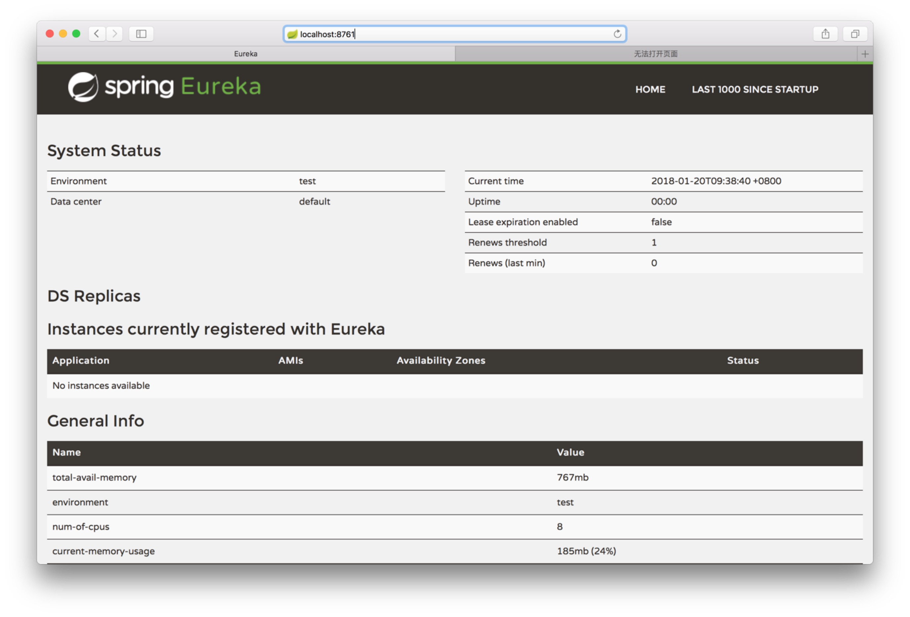
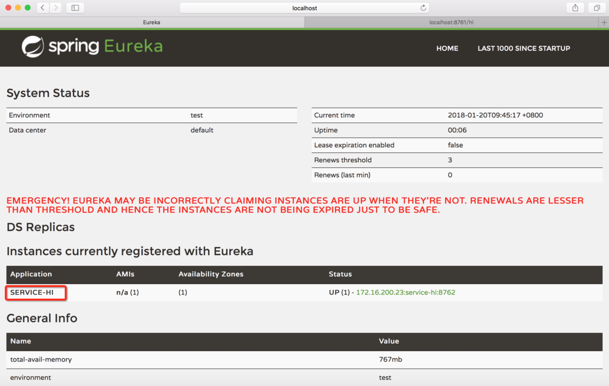
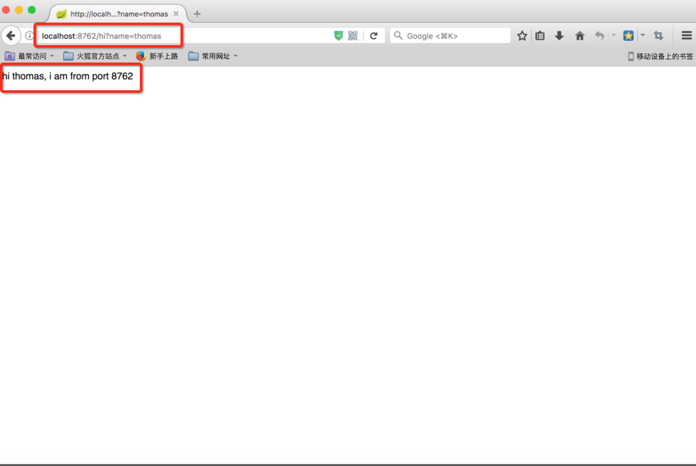

# eureka demo
eureka 在springcloud中提供服务注册和服务发现的功能，提供了完整的服务注册和服务发现的实现，是springcloud的核心组件之一

# demo 运行方式

## 启动eureka-server
```
# cd myeurekaserver
# mvn spring-boot:run  
```
打开浏览器，访问地址[eurekaserver](http://localhost:8071)  
信息如下  


## 启动eureka-client
```
# cd service-hi 
# mvn spring-boot:run 
```

刷新之前打开的eureka-server 地址，新的应用已经注册到eurekaserver中   


## 访问新注册的应用
打开新的浏览器页面，[访问地址](http://localhost:8762/hi?name=thomas)  
得到信息如下


# reference
http://blog.csdn.net/forezp/article/details/69696915
